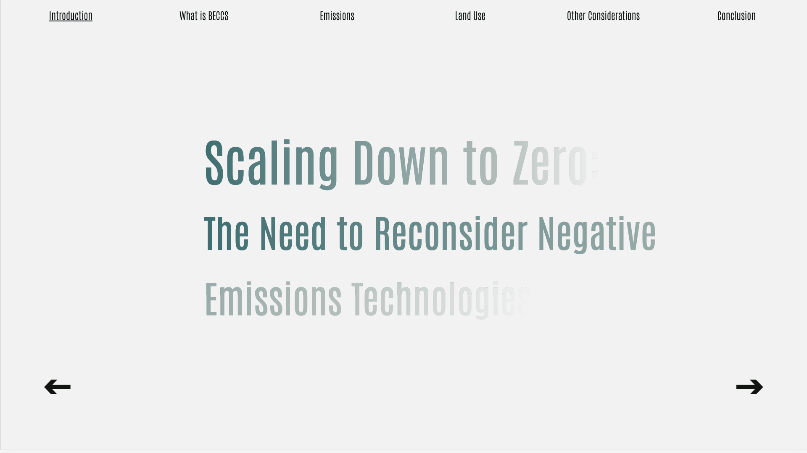

# Scaling Down to Zero: 
## The Need to Reconsider Negative Emissions Technologies

Abstract:
In 2018, the International Panel on Climate Change (IPCC) published a report declaring a 1.5°C limit i.e. limiting global temperatures to below 1.5° C above pre-industrial levels. This figure is important, because once that threshold is crossed, not only will there be grave consequences for society, but weather systems will react in unpredictable ways. Given the fact that there are no immediate plans to systematically cut C02 emissions, we have double the work cut out for us. This paper attempts to outline the main limits to and unknowns of scaling up one specific Negative Emissions Technology (NET) referred to as Bioenergy with Carbon Capture and Storage (BECCS). The final section of the paper will provide an overview of a number of strategies that are being proposed by well-recognized environmental justice organizations and must be considered in order to create lasting systemic change.

