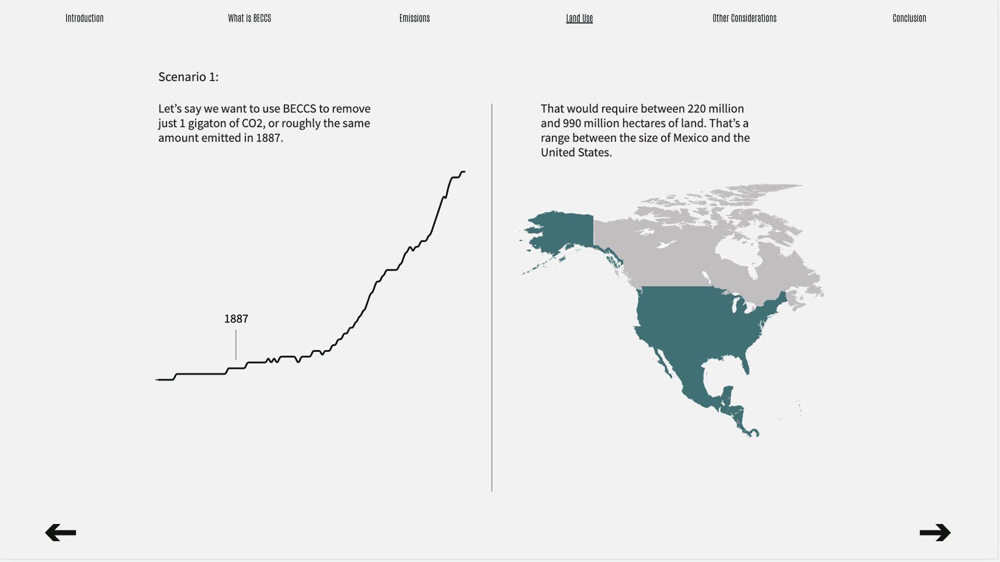

# Scaling Down to Zero: 
### The Need to Reconsider Negative Emissions Technologies
By Ripley Cleghorn - [View Live Project](https://ripleycleghorn.github.io/thesis/project-code)

## Abstract:
In 2018, the International Panel on Climate Change (IPCC) published a report declaring a 1.5°C limit i.e. limiting global temperatures to below 1.5° above pre-industrial levels. This figure is important, because once that threshold is crossed, not only will there be grave consequences for society but weather systems will react in unpredictable ways. Given the fact that there are no immediate plans to systematically cut C02 emissions, we have double the work cut out for us. This project attempts to outline the main limits to, and unknowns of, scaling up one specific Negative Emissions Technology (NET) referred to as Bioenergy with Carbon Capture and Storage (BECCS).

## Project Preview

#### Acknowledgements
Thank you to Daniel Sauter and Alec Barrett for your help and support. Thank you as well to Ege Uz for providing much-needed technical aid.

I'd also like to acknowledge Leonardo Figueroa Helland's teaching as the source of inspiration for this project.